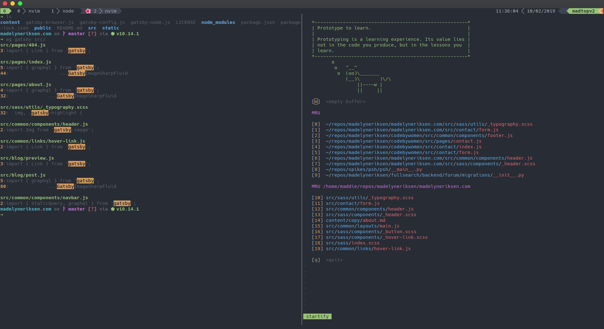

---

type: "post"
title: "Shell Yeah - How Shells Work, Plus a Shell in Python"
category: "tutorial"
date: "2019-02-10"
slug: "/blog/shell-yeah"
postImage: "./img/mesa-trees.jpg"
metaDescription: |
  Thousands of developers use shells every day for creating, writing, and testing code. Let's skim the basics of what makes a shell a shell, and write a shell in Python!

---

To create this website, I installed `npm`, edited posts with `vim`, and launched a local development server from my favorite shell, `zsh`. Referred to as a _command line_, shells have been a critical part of computer systems for almost as long as we have had computer systems.

And despite how comfortable I am with getting work done in the shell, I had almost no idea how they _actually_ work until recently. Here's an (extremely) abridged version.

**Note:** Unlike some of my other tutorials, this tutorial is Linux specific. You'll need either a computer running Linux or a virtual machine to follow along.

## What Does A Shell Do?

Shells have a few core responsibilities:

* Shells must accept input from the user,
* Shells must parse input into commands,
* Shells must launch new programs according to commands, and
* Shells then must show us the results of those commands.



> Shells have a few basic responsibilities, but there is so much they can do.

We can create these essential shell features in an abstract way with Python. But before we dive into code, let's get a little background knowledge on what makes a Unix shell tick.

## Launching Programs Via fork-exec

When a Unix system starts up, there's only one process. You can't spawn processes other than the first without a trick called "fork-exec".

You might be familiar with [forking](https://en.wikipedia.org/wiki/Fork_(system_call)), which is when a process "splits" itself into a parent and child process. This is critical to a shell (and other processes) because there is no other way to launch new processes.

`exec` is a system call that _replaces_ the current program in a process with a brand new process. The new program replaces the first, removing all information the first had.

A shell can launch a new process in a similar way. Here's a walkthrough at a high level:

* User enters a command
* Fork the current process
* If I'm the child, replace myself with the user's command using `exec`
* Give the results to the user via the parent process

This is how every process besides `init` is spawned on Linux. Init systems like `systemd` or `runit` are just processes that run at `PID1` that use `fork-exec` to launch all the other daemons your computer relies on.

## System Calls

`fork` and `exec` are both _system calls_, low level services provided by the kernel itself. Other system calls handle changing directories (`chdir`), reading files (`open`), or ending processes (`kill`). System calls are important for creating a shell, because there are some common programs that require a system call on the parent process.

For example, `cd` would never work in a `fork-exec` manner by default; the parent process would `fork` a child process, the child process would `exec` a `chdir` call, and... our parent process is in the same directory. The child changed directories, not the parent.

## Basics Of Our Shell

Lets take the information we have now, and use it to create the basics of our shell! For starters, we will write a Python function that implements the idea of `fork-exec` in a new file named `myshell.py`

```python
# myshell.py
"""A Basic Shell."""
import os


def fork_exec(command: list) -> int:
    """Fork and execute a command."""
    exit_status = 1
    # Let's just skip blank commands and return an error
    if not command:
        return exit_status
    # Fork!
    process_id = os.fork()
    if process_id == 0:
        # The PID is 0! That means we're on the child.
        # The command is exec'd and our Python program ends.
        os.execvp(command[0], command)
    else:
        # We're the parent. Wait for the child to finish
        child_process, exit_status = os.wait()
    return exit_status
```

We'll also need a parser and a `read-eval` loop for our shell. Thankfully for us, in Python there is a great parser called `shlex` that does what we want, plus the `input` function.

The program runs as a `while` loop, reading user input, evaluating it, and showing the user the results:

```python
# myshell.py
"""A Basic Shell."""
import os
import shlex

def fork_exec(command: list) -> str:
    # ...snip


def main():
    """Main shell loop."""
    # Let's add a basic prompt for our user.
    prompt_template = "{}>$ "
    exit_code = ''
    while True:
        prompt = prompt_template.format(exit_code)
        raw_command = input(prompt)
        command = shlex.split(raw_command, comments=True)
        exit_code = fork_exec(command)


if __name__ == "__main__":
    main()
```

Test it out! You actually have a (somewhat) functioning shell, and commands that aren't shell built-ins should work:

```bash
python3 myshell.py
>$ ls --color
myshell.py
0>$ 
```

To quit, you will have to use `Ctrl-C`, because we haven't added built-ins for those system calls.

## Adding Built-Ins

You might have noticed that our shell cannot call `cd`, `exit`, or similar commands. That's because those programs need to use a system call on the parent process, like we discussed up above. However, we can add them by writing our own commands.

For starters, we're going to add `cd`, `help`, and `exit` to our shell:

```python
# myshell.py
"""A Basic Shell"""
import os
import shlex

def cd(command: list) -> int:
    """Change the directory."""
    try:
        os.chdir(command[1])
        return 0
    except FileNotFoundError:
        print("Directory Not Found")
        return 1
    except IndexError:
        print("Please give an argument to `cd`")
        return 1


BUILTIN_COMMANDS = {
    'cd': cd,
    'exit': lambda *y: exit(y[:1]),
    'help': lambda *y: print("This is a basic shell!"),
}

...snip
```

We also need to add a step to our loop that checks if there is a built-in command for what the user requested. If the command is there, the command's function gets called. It's simple to add this check:

```python
# myshell.py
...snip

def main():
    """Main Shell Loop."""
    prompt_template = "{}>$ "
    exit_code = ''
    while True:
        prompt = prompt_template.format(exit_code)
        raw_command = input(prompt)
        command = shlex.split(raw_command, comments=True)
        # Here is the new check:
        if command[0] in BUILTIN_COMMANDS:
            BUILTIN_COMMANDS[command[0]](command)
            continue
        exit_code = fork_exec(command)
```

Our shell should now work a bit better! Go ahead and try it out, see how your `cd` function behaves. You should also be able to exit using `exit`!

## Conclusion and Next Steps

There is a _huge_ depth to shells, processes, and lower level operating system features. Also, there's a lot of improvements you can make to your simple shell:

* Try adding more built-ins. What's a cool feature you wish your shell had?
* Our shell doesn't support anything like pipes or redirection, which isn't very Linux-y.
* There is pretty much no error handling in our shell.

If you found this tutorial informative or helpful, feel free to [contact me](/contact) and tell me! I appreciate hearing that. Also, if there is a section that's not quite right or you would like some more explanation of, please let me know.
